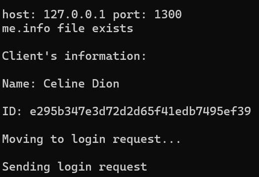

# Final Project of the Defensive Systems Programming course at the Open University

## Brief Introduction
This project features a server and a client architecture. 
 
Key components of the project include:
 

- User registration and login functionality.
- Secure exchange of asymmetric and symmetric keys.
- Secure transmission of encrypted files.
- Server-side storage of files.
- Comparison of checksums for data integrity verification.
- Utilization of a sql database for backup purposes.

## Languages and Technologies

The server-side is implemented in Python and employs SQLite for database management, CryptoDome for cryptographic operations, and selectors to enable handling multiple clients concurrently.

 
On the client side, C++ is used, utilizing Boost for communication and Crypto++ for cryptographic functionalities.
 

## Key exchange
- As in TSL, in this project we used both assymetric and symetric keys.
- The client generates a pair of assymetric keys: RSA keys (also known as Diffie-Hellman).
- The client sends the public key to the server.
- The server uses it to encrypt the symetric key: the AES key.
- The encrypted AES key is sent back to the client and can be decrypted using the client's private key.
- From that time and on, all the encrypted information will be encrpyted and decrypted with the AES key, which both the client and the server possess.

### Why use both symmetric and asymmetric keys?
- Asymmetric key's encryption and decryption operations are significantly slower compared to symmetric encryption algorithms like AES. 
- RSA requires longer key sizes to achieve comparable security levels to symmetric encryption algorithms. For example, in this project we used a **256-bit** AES key and **1024-bit** RSA key.
- To pass the symmetric key successsfully to the client without an attacker reading it, we need to use *a pair of asymmetric keys*. The public key is only for encryption, and the private key is for decryption. Every one can have the public key, but the private key is stored (hopefully) safely, client-side.

## The protocol in depth

#### Server init
1. The server runs and loads all registered clients from database.
2. The server creates a socket in the port it read from port.info file (if doesn't exists, it uses the default port 1256).
3. The server waits for requests.

#### Client init
1. The client reads the server's port and ip address from transfer.info file.
2. If me.info file exists, client assumes it is registered and loads its name and id from it for a login request.
3. If me.info is missing, the client is preparing for a registration request and loads its name from transfer.info.
4. `Registration request` or `login request` are sent to the server.

 
#### Server checks credentials
1. A valid login is a login which both name and id match a certain user in the database, with a public key from previous run.
2. If that is the case, send a `login accepted` response and utilize the public key to encrypt a symmetric key and send it to the client. Update AES key in the database.
3. Else, send `login rejected` response.
4. If the client sent a `registration request`, check if that name doesn't exist in the system already.
5. If it exists, send back a `registration rejected` response.
6. Else, send `registration accepted` and update the database.

Registration accepted
#### Client - login or registration rejected
1. If login was _rejected_, read transfer.info file and send a registration request.
2. If registration was _rejected_, try it 3 more times and then exit.

#### Client - login or registration accepted, sending public key
1. If login was accepted, *no need to send the public key* (as it was already sent before).  Wait for an AES key from the server.
2. If registration was accepted, generate a pair of _assymetic keys_ and send the _public key_ to the server.

#### Server - sending a symmetric key
1. If the public key is Ok, send back _an encrypted AES key_. Update database with public key and AES key.
2. Else, send a `registration rejected` response.

#### Client sends a file
1. Read the file and encrypt it.
2. Send the encrypted file in chunks of 1024 bytes.
3. In parallel, calculate the CRC (checksum) of the file for data integrity check.

#### Server accepts the file
1. Read the chunks and write them into a file in the client's folder as they are.
2. When the last packet is sent, read this file and decrypt it.
3. Save the decrypted file in the same location.
4. Calculate CRC and send to the client for comaprison.
4. Update file's information database.

#### Client - CRC comparison
1. If CRC equals, send a `CRC ok response`.
2. Else, try to send the file again (up to 3 times).

## Codebase structure
### Client:
- **Client module**: 
This module includes the client class and all the client methods according to the protocol (e.g send registration, send file, accept aes).
 
The client module is responsible for providing all of the relevant information 
to send to the server (e.g client's credentials, client's version, public key).
The client module uses high-level functions from FileManager module, Encoder and Encryption modules to process data. 
 
The client uses RequestSenderAndReciever object to communicate with the server.
It only provides it with the right information.
 
The client doesn't know about the packets structure and about the network interface implementation, only about the actions it should perform.

- **Protocol module**:
This module takes care of packets construction and unpacking according to the protocol.
It defines special classes for different requests and responses.
It also takes care of the *network communication:* it writes the packets to the 
socket buffer and recieves them.
> If I had more time, I think I would seperate the packets structuring and the network layers. 
- **Encryption module**:
This module is RSA and AES wrappers that the client uses for key generation and data encryption and decryption.

- **Data manipulation module**:
The encoder, which has some useful functions to display binary data as hex and 
base64 conversion.

- **File Management**:
Should include all operations related to files.
> I would put here also the functions to read from me.info and transfer.info.

- **CRC calculation**:
Yeah

### Server
- **Server module**:
This module handles connections with clients, including all methods stated by the
protocol. 
- **Client module**:
This module defines a Client entity with some information about a registered client.
- **Protocol module**:
This module defines all the classes of different requests & responses.
- **Database module**:
This module defines the database entity, stored both in the RAM in dictionaries and in a SQLite database.
- **Files module**:
Reading and writing operations, and also defines a File entity for the database.
- **Checksum (CRC) module**:
Yeah 

